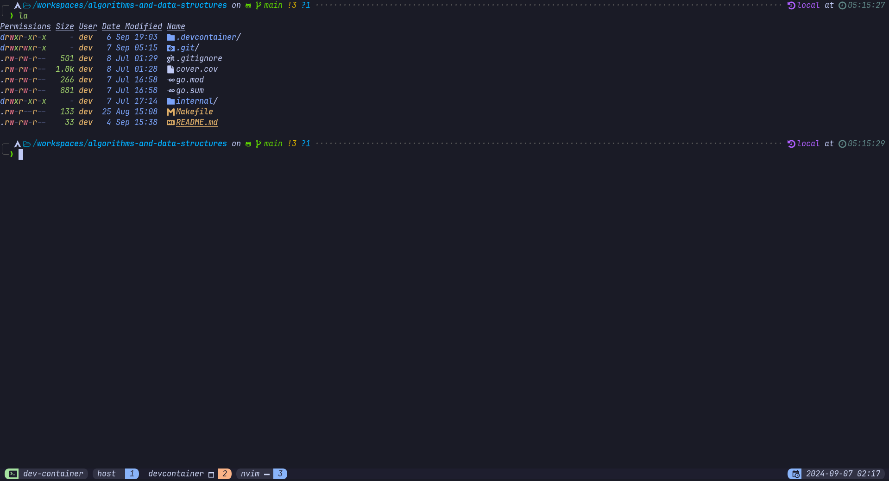

# Neovim Devcontainer



<!--toc:start-->

- [Table of Contents](#neovim-devcontainer)
  - [Tools Included](#tools-included)
  - [Requirements](#requirements)
  - [Usage](#usage)
  <!--toc:end-->

This repository provides my **Devcontainer** setup for Neovim, pre-configured
with essential development tools inside a Docker environment.

## Tools Included

- **Neovim**
- **Oh My Zsh** with Powerlevel10k theme.
- **Golang**
- **NodeJS**
- **Python** with Poetry
- **Lua**
- Utilities like `ripgrep`, `fd`, `tmux`, `fzf`, `htop`,
  `lazygit`, `exa`, `jq`...

## Requirements

- [Docker](https://www.docker.com/)
- [Devcontainer CLI](https://github.com/devcontainers/cli)

## Usage

1. Add the `.devcontainer` folder to the root of your project.

2. Build the devcontainer image:

```bash
devcontainer up --workspace-folder . --build-no-cache
```

3. Access the container:

```bash
devcontainer exec --workspace-folder . zsh
```
